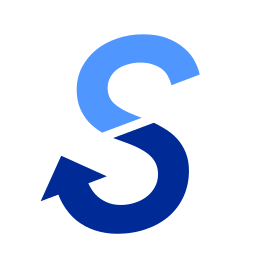

<section align="center">

# B-SAM Server - 視覚障がい者セーリング支援アプリ サーバー

[![Gorilla WebSocket](https://img.shields.io/badge/Gorilla_WebSocket-ffffff?style=for-the-badge&labelColor=a1a1a1&color=f5f5f5&logo=data:image/svg+xml;base64,PD94bWwgdmVyc2lvbj0iMS4wIiBlbmNvZGluZz0iVVRGLTgiPz4KPHN2ZyB3aWR0aD0iODAwcHgiIGhlaWdodD0iODAwcHgiIHByZXNlcnZlQXNwZWN0UmF0aW89InhNaWRZTWlkIiB2ZXJzaW9uPSIxLjEiIHZpZXdCb3g9IjAgLTMxLjUgMjU2IDI1NiIKICAgIHhtbG5zPSJodHRwOi8vd3d3LnczLm9yZy8yMDAwL3N2ZyI+CiAgICA8cGF0aAogICAgICAgIGQ9Im0xOTIuNDQgMTQ0LjY0aDMxLjc4di03Ni4zMDVsLTM1LjgwNS0zNS44MDUtMjIuNDcyIDIyLjQ3MiAyNi40OTcgMjYuNDk3djYzLjE0MXptMzEuODY0IDE1LjkzMmgtNDYuMjg2LTY0LjU2NmwtMjYuNDk3LTI2LjQ5NyAxMS4yMzYtMTEuMjM2IDIxLjg4NSAyMS44ODVoNDUuMDI4bC00NC4zNTgtNDQuNDQyIDExLjMyLTExLjMyIDQ0LjM1OCA0NC4zNTh2LTQ1LjAyOGwtMjEuODAyLTIxLjgwMiAxMS4xNTItMTEuMTUyLTU1LjA5MS01NS4zNDJoLTU0LjMzNi01Ni4zNDlsMzEuNjk2IDMxLjY5NnYwLjA4Mzg1MmgwLjE2NzcgNjUuNTcybDIzLjIyNyAyMy4yMjctMzMuOTYgMzMuOTYtMjMuMjI3LTIzLjIyN3YtMTguMDI4aC0zMS43OHYzMS4xOTNsNTUuMDA3IDU1LjAwNy0yMi4zODggMjIuMzg4IDM1LjgwNSAzNS44MDVoNTQuMzM2IDEwMS41NGwtMzEuNjk2LTMxLjUyOHoiCiAgICAgICAgZmlsbD0iI2ZmZiI+PC9wYXRoPgo8L3N2Zz4K)](https://github.com/gorilla/websocket)

</section>

視覚障がいのある方が、セーリング（ヨット競技）をより安全かつ楽しく行えるようにサポートするシステム「B-SAM（Blind Sailing Assist Mie）」のサーバーです。

コース上に設置されたブイに搭載されたスマートフォンから、そのブイの位置情報をリアルタイムで取得します。そして、この位置情報を競技者のスマートフォンに送り続け、常に最新のレース状況を把握できるようにします。これにより、視覚情報に頼ることなく、競技者はレースに集中することができます。

## 🔗 関連リポジトリ
[選手用アプリ（メイン）](https://github.com/takara2314/bsam)

[本部用アプリ](https://github.com/takara2314/bsam-admin)

[レースモニター（外部公開用）](https://github.com/takara2314/bsam-web)

## ⚖️ ライセンス
このプロジェクトは [GPL-3.0](./LICENSE) ライセンスの下で公開しています。

### 自由な利用と配布
ソフトウェアを自由に使用、修正、配布する権利が保証されています。
### ソースコードの公開
配布時にはソースコードを提供するか、入手方法を明示する必要があります。
### 派生作品の継承
派生作品も同じGPLv3ライセンスで公開しなければなりません（コピーレフト）。
### 特許権の取り扱い
ソフトウェアに含まれる特許の無償利用を認め、貢献者がユーザーに対して特許訴訟を起こすことを禁止しています。
### 商用利用
営利目的での使用や販売が可能ですが、ソースコードの公開や、派生物へのGPLv3適用などの条件を守る必要があります。

## 👨‍💻 開発者
[濱口 宝 (Takara Hamaguchi)](https://github.com/takara2314)

<small>
© 2022 NPO法人セイラビリティ三重
</small>

